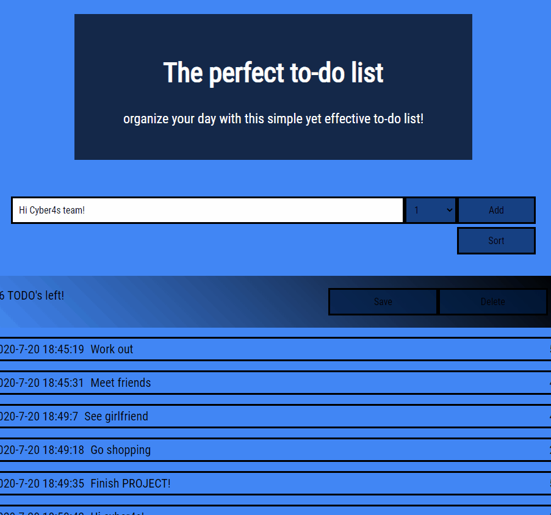

#    Zilber's pre Course Project - Todo List
This project is Todo List Web Application.

The app passed 6 tests that are included in this repository.

The project will let the user store prioritized _todo tasks_ and view/sort that list, save the list to be able to use again and search for tasks.


Preview:




## App Includes
- The web app have a heading
- The web app have two sections: Control section and View section
- The control section is where the user adds his todo task and priority, and it has three elements:
  - [\<input\>](https://developer.mozilla.org/en-US/docs/Web/HTML/Element/input) with id `textInput`.
  - [\<select\>](https://developer.mozilla.org/en-US/docs/Web/HTML/Element/select) with id `prioritySelector` (options will be: 1-5).
  - [\<button\>](https://developer.mozilla.org/en-US/docs/Web/HTML/Element/button) with id `addButton`.
- The View section is where the list of added todo tasks and data are displayed. Every added todo should be inserted to the list.
- After the user click on add button it "resets" the input value.
- Every todo item have "container" div with class `todoContainer` that will contain 3 elements:
  - An element with a class `todoText` with the text of the todo task
  - An element with a class `todoCreatedAt` that will hold the creation time of the task in a [SQL format](https://www.w3schools.com/sql/sql_dates.asp#:~:text=SQL%20Date%20Data%20Types&text=DATE%20%2D%20format%20YYYY%2DMM%2D,YEAR%20%2D%20format%20YYYY%20or%20YY)
  - An element for showing the numeric priority of the task, with a class `todoPriority`


## Running Tests

To run the tests simply run
```
$ npm run test
```


## Bonus Tasks
- Drop down search bar.
- Delete mechanism.
- TODO list is consistent, saved on local storage.
- Able to change priority by hovering over current priority. Enter to set new value.
- The app is responsive, and has media query to fit certain displays better.
- Help button to guide the user.
- Deployed to the internet! https://classy-todo-list-git-onwork.zilbers.vercel.app/


 ENJOY AND THANKS!